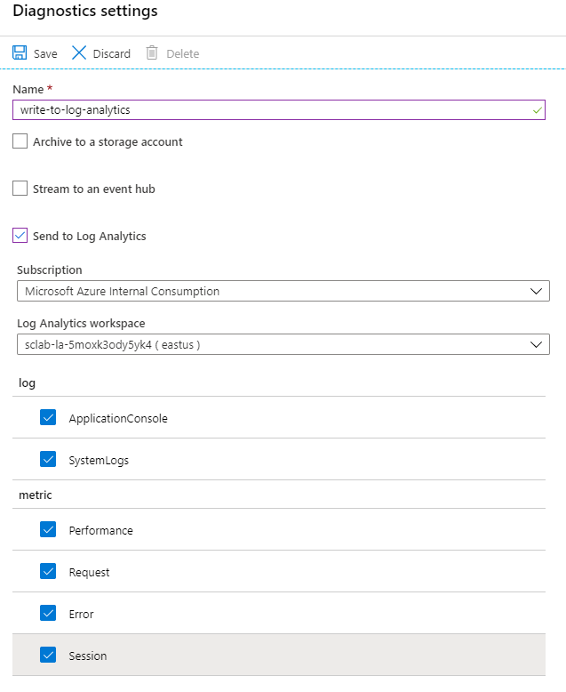

# 03 - Configure application logs

__This guide is part of the [Azure Spring Cloud training](../README.md)__

Access Spring Boot applications logs and distributed tracing to understand common issues.

---

## Configure log aggregation

There are actually three ways to access your application's logs: [Azure Storage](https://docs.microsoft.com/en-us/azure/storage/common/storage-introduction/?WT.mc_id=azurespringcloud-github-judubois), [Azure Events Hub](https://docs.microsoft.com/en-us/azure/event-hubs/?WT.mc_id=azurespringcloud-github-judubois), and [Log Analytics](https://docs.microsoft.com/en-us/azure/azure-monitor/log-query/get-started-portal/?WT.mc_id=azurespringcloud-github-judubois). We will focus here on Log Analytics as it's the most common one, and as it's integrated into Azure Spring Cloud.

[Log Analytics](https://docs.microsoft.com/en-us/azure/azure-monitor/log-query/get-started-portal/?WT.mc_id=azurespringcloud-github-judubois) is part of [Azure Monitor](https://azure.microsoft.com/en-us/services/monitor/?WT.mc_id=azurespringcloud-github-judubois), which is well-integrated into Azure Spring Cloud and which we will also use for metrics monitoring.

Having completed the setup in [Section 00](../00-setup-your-environment/README.md), you should have a Log Analytics workspace named `sclab-la-<unique string>` in your resource group for this workshop. We must now configure our Azure Spring Cloud instance to send its data to this workspace.

- Go to the "Overview" page of your Azure Spring Cloud instance and select "Diagnostic settings" in the "Monitoring" section of the navigation pane.
- Delete any diagnostic settings you may see there.
- Click on "Add diagnostic setting" and configure your instance to send all its logs to the Log analytics workspace that we just created.
- Fill in the values as shown here and click "Save".

## Configure Distributed Tracing

Distributed tracing allows you to observe interaction among microservices and diagnose issues. We will see this feature in action in Section 9, but because its configuration requires some time to be applied, let's enable it now:

- Go to the [the Azure portal](https://portal.azure.com/?WT.mc_id=azurespringcloud-github-judubois).
- Go to the Azure Spring Cloud instance and click on "Distributed Tracing" (under Monitoring).
  - Click on "Edit Settings" and select the App Insights workspace created in Section 00 (named `sclab-ai-<unique string>`).
  - Once the Application Insights configuration is saved, click "Enable" at the top of the "Distributed Tracing". If the button is not clickable, then Distributed Tracing is already enabled.

---

⬅️ Previous guide: [02 - Build a simple Spring Boot microservice](../02-build-a-simple-spring-boot-microservice/README.md)

➡️ Next guide: [04 - Configure a Spring Cloud Config server](../04-configure-a-spring-cloud-config-server/README.md)
