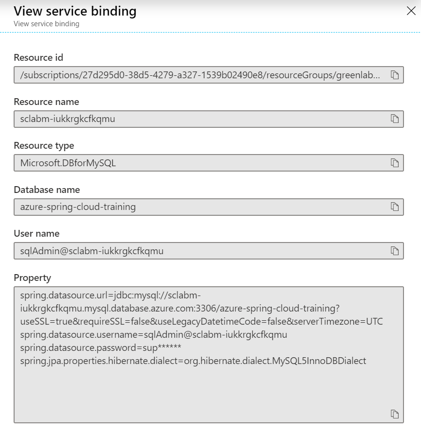

# 07 - Build a Spring Boot microservice using MySQL

__This guide is part of the [Azure Spring Cloud training](../README.md)__

Build a classical Spring Boot application that uses JPA to acess a [MySQL database managed by Azure](https://docs.microsoft.com/en-us/azure/mysql/?WT.mc_id=azurespringcloud-github-judubois).

---

## Create a MySQL Server instance

- Go to the [the Azure portal](https://portal.azure.com/?WT.mc_id=azurespringcloud-github-judubois) and look for "Azure Database for MySQL servers" in the search box.
- Create a new database
  - Write down the password in a safe place
  - You can choose a low-budget "Basic" database


- Once the databas is created, select it and go to "Connection security"
  - Enable "Allow access to Azure services"
  - Add your current IP to the firewall rules, so you can access it from your machine

> If you need to know your current external IP, you can use https://www.whatismyip.com/


- Connect to your database using your favorite database explorer tool
  - For example [MySQL Workbench](https://www.mysql.com/fr/products/workbench/)
  - The admin login name is available in the "overview" section of your database, it is in the form of `username@database`
- Create a new schema named `azure-spring-cloud-training`

# Create a Spring Boot microservice

The microservice that we create in this guide is [available here](weather-service/).

To create our microservice, we will use [https://start.spring.io/](https://start.spring.io/) with the command line:

```
curl https://start.spring.io/starter.tgz -d dependencies=web,data-jpa,mysql,cloud-eureka,cloud-config-client -d baseDir=weather-service | tar -xzvf -
```

> We use the `Spring Web`, `Spring Data JPA`, `MySQL Driver`, `Eureka Discovery Client` and the `Config Client` components.

## Add a "cloud" Maven profile

*To deploy to Azure Spring Cloud, we add a "cloud" Maven profile like in the guide [05 - Build a Spring Boot microservice using Spring Cloud features](../05-build-a-spring-boot-microservice-using-spring-cloud-features/README.md)*

At the end of the application's `pom.xml` file (just before the closing `</project>` XML node), add the following code:

```xml
	<profiles>
		<profile>
			<id>cloud</id>
			<repositories>
				<repository>
					<id>nexus-snapshots</id>
					<url>https://oss.sonatype.org/content/repositories/snapshots/</url>
					<snapshots>
						<enabled>true</enabled>
					</snapshots>
				</repository>
			</repositories>
			<dependencies>
				<dependency>
					<groupId>com.microsoft.azure</groupId>
					<artifactId>spring-cloud-starter-azure-spring-cloud-client</artifactId>
					<version>2.1.0-SNAPSHOT</version>
				</dependency>
			</dependencies>
		</profile>
	</profiles>
```

## Add Spring code to get the data from the database

Next to the `DemoApplication` class, create a `Weather` JPA entity:

```java
package com.example.demo;

import javax.persistence.Entity;
import javax.persistence.Id;

@Entity
public class Weather {

    @Id
    private String city;

    private String description;

    public String getCity() {
        return city;
    }

    public void setCity(String city) {
        this.city = city;
    }

    public String getDescription() {
        return description;
    }

    public void setDescription(String description) {
        this.description = description;
    }
}
```

Then, create a Spring Data repository to manage this entity, called `WeatherRepository`:

```java
package com.example.demo;

import org.springframework.data.repository.CrudRepository;

public interface WeatherRepository extends CrudRepository<Weather, String> {
}
```

And finish coding this application by adding a Spring MVC controller called `WeatherController`:

```java
package com.example.demo;

import org.springframework.stereotype.Controller;
import org.springframework.web.bind.annotation.*;

@Controller
@RequestMapping(path="/weather")
public class WeatherController {

    private final WeatherRepository weatherRepository;

    public WeatherController(WeatherRepository weatherRepository) {
        this.weatherRepository = weatherRepository;
    }

    @GetMapping("/city")
    public @ResponseBody String getWeatherForCity(@RequestParam("name") String cityName) {
        return weatherRepository.findById(cityName).get().getDescription();
    }
}
```

## Add sample data in MySQL

In order to have Hibernate automatically create your database, open up the `src/main/resources/application.properties` file and add:

```
spring.jpa.hibernate.ddl-auto=create
```

Then, in order to have Spring Boot add sample data at startup, create a `src/main/resources/import.sql` file and add:

```sql
INSERT INTO `azure-spring-cloud-training`.`weather` (`city`, `description`) VALUES ('Paris, France', 'Very cloudy!');
INSERT INTO `azure-spring-cloud-training`.`weather` (`city`, `description`) VALUES ('London, UK', 'Quite cloudy');
```

## Create the application on Azure Spring Cloud

As in [02 - Build a simple Spring Boot microservice](../02-build-a-simple-spring-boot-microservice/README.md), create a specific `weather-service` application in your Azure Spring Cloud cluster:

```
az spring-cloud app create -n weather-service
```

## Bind the MySQL database to the application

Azure Spring Cloud can automatically bind the MySQL database we created to our microservice.

- Go to "App Management" in your Azure Spring Cloud cluster.
- Select the `weather-service` application
- Go to `Service bindings`
- Click on `Create service binding``
  - Give your binding a name, for example `mysql-weather`
  - For `Binding type`, select `Azure database for MySQL``
  - Select your database, and input your admin login and password
  - Click on `Create` to create the database binding



## Deploy the application

You can now build your "weather-service" project and send it to Azure Spring Cloud:

```
./mvnw package -DskipTests -Pcloud
az spring-cloud app deploy -n weather-service --jar-path target/demo-0.0.1-SNAPSHOT.jar
```

## Test the project in the cloud

- Go to "App Management" in your Azure Spring Cloud cluster.
  - Verify that `weather-service` has a `Discovery status` which says `UP(1),DOWN(0)`. This shows that it is correctly registered in Eureka.
  - Select `weather-service` to have more information on the microservice.
- Copy/paste the "Test Endpoint" that is provided.

You can now use cURL to test the `/weather/city` endpoint. For example, to test for `Paris, France` city, append to the end of the test endpoint: `/weather/city?name=Paris%2C%20France`.	

```
"Very cloudy!"
```

If you need to check your code, the final project is available in the ["weather-service" folder](weather-service/).

---

⬅️ Previous guide: [06 - Build a reactive Spring Boot microservice using Cosmos DB](../06-build-a-reactive-spring-boot-microservice-using-cosmosdb/README.md)

➡️ Next guide: [08 - Build a Spring Cloud Gateway](../08-build-a-spring-cloud-gateway/README.md)
