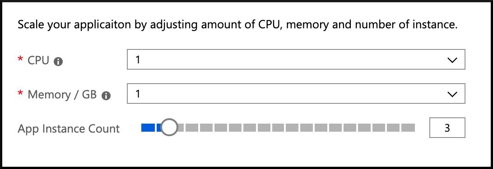

# 09 - Putting it all together, a complete microservice stack

__This guide is part of the [Azure Spring Cloud training](../README.md)__

Use a front-end to access graphically our complete microservice stack. Monitor our services with Azure Spring Cloud's distributed tracing mechanism, and scale our services depending on our needs.

---

## Add a front-end to the microservices stack

We now have a complete microservices stack:

- A gateway based on Spring Cloud Gateway.
- A reactive `city-servivce` microservice, that stores its data on Cosmos DB.
- A `weather-service` microservice, that stores its data on MySQL

In order to finish this architecture, we need to add a front-end to it:

- We have already built a VueJS application, that is available in the ["weather-app" folder](weather-app/).
- This front-end could be hosted in Azure Spring Cloud, using the same domain name (this won't be the case in this guide, and this is why we enabled CORS in our gateway earlier).
- If you are familiar with NodeJS and Vue CLI, you can run this application locally by typing `npm install && vue ui`.

In order to simplify this part, which has little value for understanding Azure Spring Cloud, we have already this application running:

__[https://spring-training.azureedge.net/](https://spring-training.azureedge.net/)__

For your information, this website is hosted on Azure Storage and served through Azure CDN for optimum performance.

Go to [https://spring-training.azureedge.net/](https://spring-training.azureedge.net/), input your Spring Cloud Gateway's public URL in the text field, and click on "Go". You should see the following screen:


## Add distributed tracing to better understand the architecture

In each application (`city-service`, `weather-service`, `gateway`), open up the `pom.xml` file and add the following Maven dependencies:

```java
        <dependency>
            <groupId>org.springframework.cloud</groupId>
            <artifactId>spring-cloud-starter-sleuth</artifactId>
        </dependency>
        <dependency>
            <groupId>org.springframework.cloud</groupId>
            <artifactId>spring-cloud-starter-zipkin</artifactId>
        </dependency>
```

Those dependencies will add distributed tracing capablities to our microservices and gateway.

Now you need to update those applications on Azure Spring Cloud.

Re-deploy the `city-service` microservice:

```bash
./mvnw package -DskipTests -Pcloud
az spring-cloud app deploy -n city-service --jar-path target/demo-0.0.1-SNAPSHOT.jar
```

Re-deploy the `weather-service` microservice:

```bash
./mvnw package -DskipTests -Pcloud
az spring-cloud app deploy -n weather-service --jar-path target/demo-0.0.1-SNAPSHOT.jar
```

Re-deploy the `gateway` gateway:

```bash
./mvnw package -DskipTests -Pcloud
az spring-cloud app deploy -n gateway --jar-path target/demo-0.0.1-SNAPSHOT.jar
```

Once everything is deployed:

- Go to the [the Azure portal](https://portal.azure.com/?WT.mc_id=azurespringcloud-github-judubois).
- Go to the overview page of your Azure Spring Cloud server, and select "Distributed tracing" in the menu.
  - Click on "enable" and create a new Application Insights instance to store distributed tracing data.
- Use the VueJS application on [https://spring-training.azureedge.net/](https://spring-training.azureedge.net/) to generate some traffic on our microservices stack. Tracing data can take a couple of minutes to be ingested by the system, so use this time to generate some load.

In the "Distributed tracing" menu, you should now have access to a full application map, as well as a search engine that allows to find performance bottlenecks:


## Scale applications

Now that we have distributed tracing enabled, we can scale applications depending on our needs.

- Go to the [the Azure portal](https://portal.azure.com/?WT.mc_id=azurespringcloud-github-judubois).
- Go to the overview page of your Azure Spring Cloud server, and select "App management" in the menu.
  - Select one service, and click on "Scale"
  - Modify the number of instances, or change the CPU/RAM of the instance



---

⬅️ Previous guide: [08 - Build a Spring Cloud Gateway](../08-build-a-spring-cloud-gateway/README.md)

➡️ Next guide: [10 - Blue/Green deployment](../10-blue-green-deployment/README.md)
