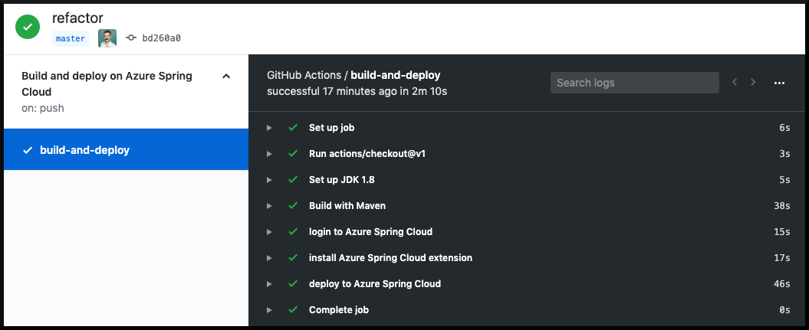

# 11 - Configure CI/CD

__This guide is part of the [Azure Spring Cloud training](../README.md)__

Configure a Continuous Integration / Continuous Deployement platform using GitHub Actions, so our Spring Boot microservices are automatically deployed.

---

Our microservices and gateway are easy to deploy manually, but it is of course better to automate all those tasks! We are going to use [GitHub actions](https://github.com/features/actions) as a Continuous Integration / Continuous Deployement platform (or CI/CD for short), but this configuration is rather simple is it should be trivial to port it to another platform.

We are going to automate the deployment of the `weather-service` microservice that was developped in [07 - Build a Spring Boot microservice using MySQL](../07-build-a-spring-boot-microservice-using-mysql/README.md). It is exactly the same configuration that would need to be done for the `city-service` microservice and the gateway, so if you want to automate them too, you can just copy/paste what is being done in the current guide.

## Configure GitHub

If it is not already done, [create a GitHub] repository and commit the code from the `weather-service` microservice into that repository.

You now need to allow access from your GitHub workflow to your Azure Spring Cloud cluster. Open up a terminal and type the following command, replacing `<azure-subscription-id>` by you Azure subscription ID, and `<resource-group-name>` by the name of the resource group in which your Azure Spring Cloud cluster is located:

```bash
az ad sp create-for-rbac --name spring-cloud-training --role contributor --scopes /subscriptions/<azure-subscription-id>/resourceGroups/<resource-group-name> --sdk-auth
```

This should output a JSON text, that you need to copy.

Then, in your GitHub project, select `Settings > Secrets` and add a new secret called `AZURE_CREDENTIALS`. Paste the JSON text you just copied into that secret.

## Create a GitHub action

In your project, create a new directory called `.github/workflows` and add a file called `azure-spring-cloud.yml` in it. This file is a GitHub workflow, and will use the secret we just configured above, in order to deploy the application to your Azure Spring Cloud cluster.

In that file, copy/paste the following content:

```yaml
name: Build and deploy on Azure Spring Cloud

on: [push]

jobs:
  build-and-deploy:
    runs-on: ubuntu-latest
    steps:
    - uses: actions/checkout@v1
    - name: Set up JDK 1.8
      uses: actions/setup-java@v1
      with:
        java-version: 1.8
    - name: Build with Maven
      run: mvn package -DskipTests -Pcloud
    - name: Login to Azure Spring Cloud
      uses: azure/login@v1
      with:
        creds: ${{ secrets.AZURE_CREDENTIALS }}
    - name: Install Azure Spring Cloud extension
      run: az extension add --name spring-cloud
    - name: Deploy to Azure Spring Cloud
      run: az spring-cloud app deploy --resource-group azure-spring-cloud --service azure-spring-cloud-training --name weather-service --jar-path target/demo-0.0.1-SNAPSHOT.jar
```

This workflow does the following:

- It sets up the JDK
- It compiles and packages the application using Maven
- It authenticates to Azure Spring Cloud using the credentials we just configured
- It adds the Azure Spring Cloud extensions to the Azure CLI (this step should disappear when the service is in final release)
- It deploys the application to your Azure Spring Cloud cluster

__Warning__ To deploy your application, you need to input your real Azure resource group and Azure Spring Cloud cluster name in that last command line.

This workflow is configured to be triggered whenever code is pushed to the repository.
There are many other [events that trigger GitHub actions](https://help.github.com/en/articles/events-that-trigger-workflows): you could for example deploy each time a new tag is created on the project.

## Test the GitHub action

You can now commit and push the `azure-spring-cloud.yml` file we just created.

Going to the `Actions` tab of your  GitHub project, you should see that your project is automatically built and deployed to your Azure Spring Cloud cluster:



Congratulations! Each time you `git push` your code, your microservice is now automatically deployed to production.

---

⬅️ Previous guide:  [10 - Blue/Green deployment](../10-blue-green-deployment/README.md)
